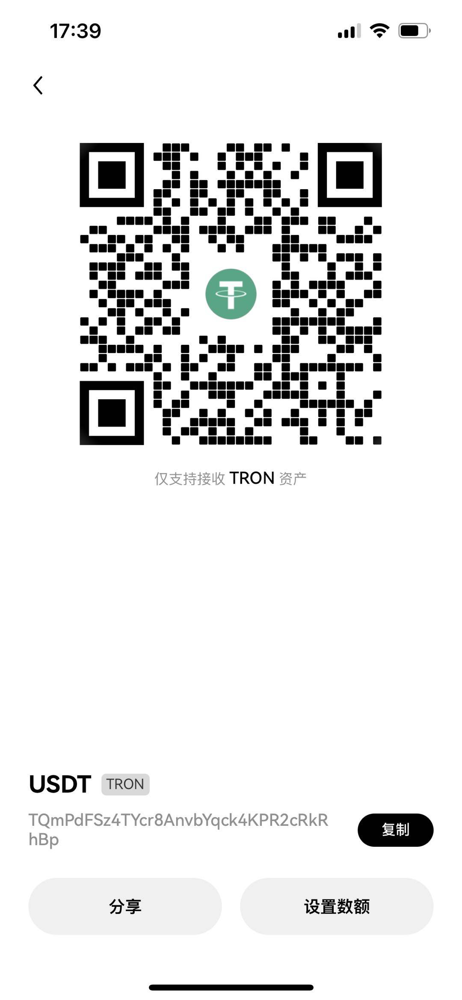

### 背包 backpack交易所刷量程序 （记得加入我们战队：https://backpack.exchange/join/996）

当前程序是以简单的做市方式来在Backpack交易所数量，支持开启对冲，当前主要是使用lighter对冲。

可以不使用对冲模式运行，对冲程序和主刷量程序是独立的。建议先忽略lighter对冲的king_of_hedge.py
先从简单的Backpack单交易所刷量开始。

配置的时候需要配置config/config.py中的backpack AK就
可以运行了。

主程序是market_maker.py，运行之前需要根据自己的需要
调整如下三个参数：
ticker、quantity、max_position_count，
其他的参数都不用调整。 这三个参数分别表示加密货币代号、单次
挂单买的数量、最大持有的数量。 这三个都很重要，刚开始运行的时候
一定要严格限定最大头寸！！！！！！

### 加入Backpack战队，享受更低手续费
https://backpack.exchange/join/996

一起为10万分目标而奋斗！！

### 合作共赢
如果想要有进一步的合作，或者想完全托管，可以私我TG。

### 请喝一杯咖啡
USDT TRC2.0 
地址如下：
TQmPdFSz4TYcr8AnvbYqck4KPR2cRkRhBp

捐赠超过150U的朋友，可以添加本人TG，可以免费指导一次！！

